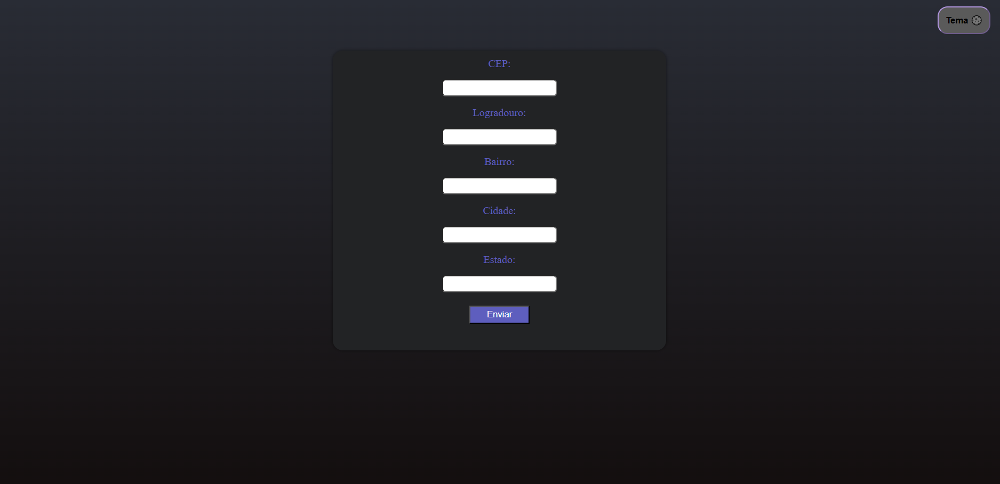
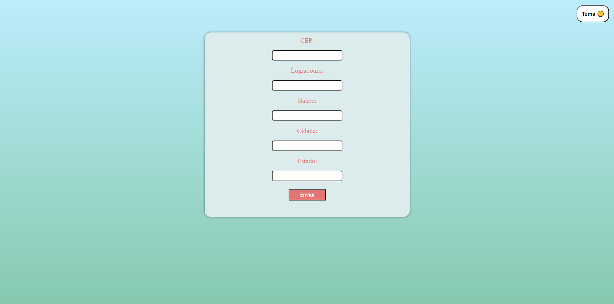

# CompletadorDeLugar

## Descrição
CompletadorDeLugar é um projeto desenvolvido para demonstrar conceitos de API. Esta ferramenta tem como objetivo o uso das ferramentas fetchAPI, viaCEP, webStorageAPI.


## Funcionalidades
- Completar automaticamente outros campos do formulário de endereço utilizando a API ViaCEP.
- Alterar o tema do site entre opções disponíveis.
- Utilizar a Web Storage API para armazenar o tema atual e os dados dos outros campos do formulário.




## Instalação
1. Clone o repositório:
    ```bash
    git clone https://github.com/seu-usuario/CompletadorDeLugar.git
    ```
2. Navegue até o diretório do projeto:
    ```bash
    cd CompletadorDeLugar
    ```